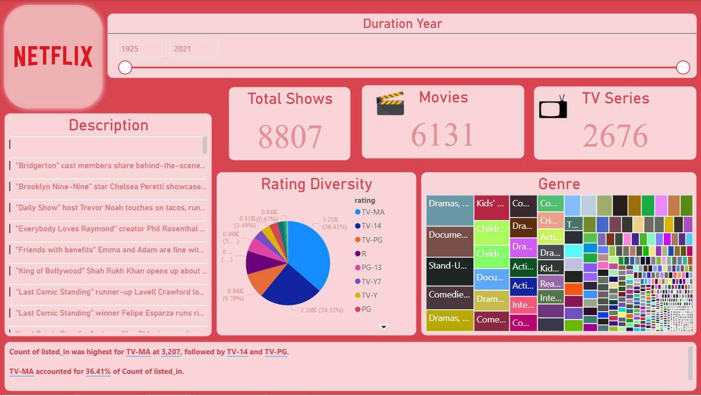

# OTT Media Dashboard

## Project Overview
This Power BI dashboard provides an in-depth analysis of OTT media content, including movies and TV shows. It visualizes key metrics such as content duration, ratings, and genre distribution across different years.

## 📊 Dashboard Preview

## Key Insights
- **Total Content:** Analysis of over 9,000 titles.
- **Top Genres:** Insights into the most produced genres (Documentaries, Dramas, Comedy).
- **Ratings:** Breakdown of content by ratings (TV-MA, TV-14, R, etc.).
- **Directors:** Highlight of top contributing directors like Rajiv Chilaka.

## Files in this Repository
- **OTT Media.pbix:** The main Power BI file.
- **OTT_Data.xlsx:** The extracted raw data used for analysis.

## How to View
1. Download the `.pbix` file.
2. Open it in Microsoft Power BI Desktop.
